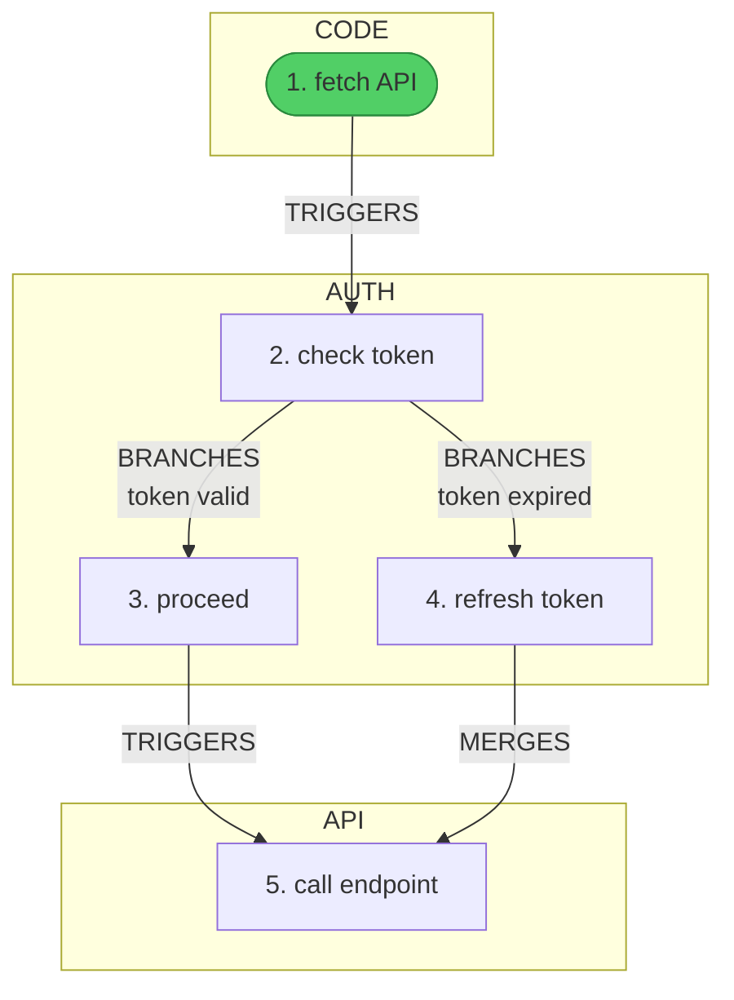

# audit-flow

An [Agent Skill](https://agentskills.io) for thinking about systems before (and after) you build them.

Tell your AI agent to trace a flow — it walks through your codebase recording every step in SQLite, then exports Mermaid diagrams, Markdown reports, JSON, and YAML. Works with [Claude Code](https://docs.anthropic.com/en/docs/claude-code), [OpenAI Codex CLI](https://github.com/openai/codex), and any agent that supports the [Agent Skills spec](https://agentskills.io/specification).

## Why

Most teams jump straight to code. The architecture lives in someone's head, a stale Confluence page, or a whiteboard photo rotting in Slack.

audit-flow makes system thinking a first-class artifact:

- **Before building** — sketch the flow as a DAG. Which layers? What triggers what? Where does data move? Your brainstorm session produces a queryable database and exportable diagrams, not ephemeral notes.
- **After building** — trace the real implementation. Compare what you planned vs what you built. The ideation flow and the documentation flow live in the same database.
- **When things break** — trace the bug path. Your incident post-mortem links back to the original design flow. Findings accumulate across sessions.
- **Over time** — 10 audits later, you have a queryable map of your entire system. New engineer joins? `audit.py list` shows every flow ever traced.

It's TDD for architecture. Trace the flow first, implement, trace again to verify.

## What It Looks Like

```
"Audit the auth login flow"

→ Agent traces through your codebase
→ Records 47 steps across CODE, API, AUTH, DATA, NETWORK layers
→ Flags 3 security concerns
→ Exports Mermaid diagram + Markdown report to docs/audits/
```

```
"Brainstorm the export feature before we build it"

→ Agent sketches the flow as a DAG (no code exists yet)
→ Records design questions as findings
→ You iterate on the flow interactively
→ Export the design doc, then build against it
```



## Install

### Via skills CLI ([skills.sh](https://skills.sh))

```bash
npx skills add ArunJRK/audit-flow
```

### Via git clone

```bash
# From your project root
git clone https://github.com/ArunJRK/audit-flow.git .claude/skills/audit-flow

# Run setup (initializes DB + configures git merge driver)
bash .claude/skills/audit-flow/setup.sh
```

### Manual

Copy the `audit-flow/` directory into `.claude/skills/` in your project. Your agent discovers it automatically.

## Requirements

- Python 3.8+ (stdlib only — `sqlite3`, `json`, `csv`, `argparse`)
- Git (for merge/diff drivers)
- Optional: `pyyaml` for YAML export

**Zero external dependencies.**

## How It Works

You say "audit the auth flow" or "brainstorm the payment feature." Your agent:

1. Creates a **session** (audit container with git context)
2. Creates a **flow** (named DAG with an entry point)
3. Traces through your code (or sketches a design), inserting **tuples** — each one a step: which layer, what action, which file
4. Connects tuples with **edges** — semantic relations like `TRIGGERS`, `READS`, `WRITES`, `BRANCHES`, `MERGES`
5. Records **findings** — security concerns, design questions, things the analyst notices
6. Everything persists in `.audit/audit.db` (SQLite)
7. Exports to Mermaid flowcharts, Markdown reports, JSON, YAML

```
Session (audit container)
  └── Flow (named DAG with entry point)
       └── Tuple (node: layer + action + subject)
            └── Edge (relation + optional condition)
       └── Finding (severity + category + description)
```

### Interactive Workflow

Your agent asks you at each decision point:

```
Agent: I'll trace the auth flow. Let me set up the session.
       Name: auth-login-audit
       Purpose: security-audit
       Granularity: fine or coarse?

You:   Fine — function-level detail

Agent: [traces through code, recording tuples and edges in SQLite]

       Found 3 concerns:
       - [HIGH] Token stored in localStorage (XSS risk)
       - [MEDIUM] No PKCE in OAuth flow
       - [LOW] Token visible in Redux DevTools

       Export format?

You:   Mermaid and markdown

Agent: [exports to docs/audits/auth-login-audit/]
```

## Use Cases

| Purpose | Use For |
|---------|---------|
| `security-audit` | Trace auth flows, find vulnerabilities, compliance checks |
| `documentation` | Document how systems work, onboarding material |
| `compliance` | SOC2/HIPAA evidence, data flow documentation |
| `ideation` | Design new features by sketching flows before code exists |
| `brainstorming` | Free-form idea exploration, what-if scenarios, divergent thinking |
| `debugging` | Trace bugs through the system, reproduce issue paths |
| `architecture-review` | Evaluate system design, identify coupling, review boundaries |
| `incident-review` | Post-mortem flow tracing, root cause analysis |

### The Compound Effect

A single audit is useful. Many audits are powerful:

- **Ideation** → sketch the flow → **Documentation** → trace what you built → **Security Audit** → find what's wrong → **Incident Review** → trace what broke
- Same data model, same database, linked by sessions. Your architecture becomes queryable: "show me every AUTH-layer step across all flows" is a SQL query.
- New engineer runs `audit.py list` and sees every flow ever traced — with entry points, findings, and Mermaid diagrams.

## Layers & Relations

**5 layers** classify where each step happens:

| Layer | Examples |
|-------|---------|
| `CODE` | Function calls, event handlers, components |
| `API` | HTTP endpoints, service boundaries |
| `AUTH` | Authentication, authorization, token ops |
| `DATA` | Database queries, cache reads, state mutations |
| `NETWORK` | External HTTP calls, WebSocket, SSE |

**7 relations** define how steps connect:

| Relation | Arrow | Meaning |
|----------|-------|---------|
| `TRIGGERS` | `-->` solid | A causes B to execute |
| `READS` | `-.->` dotted | A consumes data from B |
| `WRITES` | `==>` thick | A mutates data in B |
| `VALIDATES` | `-->` solid | A checks/verifies B |
| `TRANSFORMS` | `-->` solid | A converts data for B |
| `BRANCHES` | `-->` solid | Conditional paths (**requires** condition label) |
| `MERGES` | `-->` solid | Multiple paths converge |

## Key Features

### Non-Linear Flows

Not just linear traces — supports branching and merging:

```sql
-- Branch: token check → two outcomes
INSERT INTO edges (from_tuple, to_tuple, relation, condition)
VALUES (5, 6, 'BRANCHES', 'token valid'),
       (5, 7, 'BRANCHES', 'token expired');

-- Merge: both paths converge at the API call
INSERT INTO edges (from_tuple, to_tuple, relation)
VALUES (6, 8, 'TRIGGERS'),
       (7, 8, 'MERGES');
```

### Findings (Not Flow Steps)

What the system **does** → tuples. What the analyst **notes** → findings.

This distinction matters. Observations like "no cross-tab sync" or "possible replay attack" are not system actions — they're analyst insights. Recording them as findings keeps diagrams clean and reports useful.

```sql
INSERT INTO findings (session_id, flow_id, severity, category, description, tuple_refs)
VALUES ('my-session', 1, 'high', 'token-storage',
        'Access token in localStorage — vulnerable to XSS', '[7, 8]');
```

### Mermaid Export

Auto-generated diagrams with:
- BFS step numbering from entry point
- Green entry point marker (stadium shape)
- Layer-based subgraphs
- Relation-specific arrow styles (solid/dotted/thick)
- Observation separation (concern chains → dashed OBSERVATIONS subgraph)
- HTML entity sanitization for safe labels
- Configurable direction (`TD` or `LR`)

### Validation

```bash
python scripts/audit.py validate my-session
```

| Check | Severity |
|-------|----------|
| BRANCHES without condition | ERROR |
| Node count >= 60 | ERROR — must split |
| Node count >= 40 | WARN — consider splitting |
| Orphan nodes | WARN |
| Duplicate labels | WARN |
| No entry point | WARN |

### Git Merge Driver

SQLite is binary — `git merge` can't resolve conflicts. This skill includes a custom merge driver:

```bash
python scripts/audit.py git-setup    # one-time
```

On conflict, git auto-calls the driver which:
1. Opens both SQLite databases
2. Merges sessions by name (later `updated_at` wins)
3. Flows follow parent session winner
4. Remaps all integer PKs sequentially
5. Deduplicates findings by content

### CSV Backup

```bash
python scripts/audit.py csv-export   # DB → .audit/csv/*.csv
python scripts/audit.py csv-import   # CSV → DB
```

## CLI Reference

| Command | Purpose |
|---------|---------|
| `audit.py init` | Initialize SQLite database |
| `audit.py list` | List all audit sessions |
| `audit.py show <session>` | Show session overview |
| `audit.py show <session> <flow>` | Show flow details |
| `audit.py export <session>` | Export all formats |
| `audit.py export <session> -f <flow>` | Export specific flow |
| `audit.py export <session> -F mermaid` | Export specific format |
| `audit.py export <session> -d LR` | Horizontal Mermaid layout |
| `audit.py validate <session>` | Validate before export |
| `audit.py git-setup` | Configure git merge/diff drivers |
| `audit.py csv-export` | Backup DB to CSV |
| `audit.py csv-import` | Restore DB from CSV |

## Project Structure

```
audit-flow/
├── SKILL.md           # Agent skill definition (frontmatter + instructions)
├── COMMANDS.md        # SQL reference for manual use
├── EXAMPLES.md        # Full examples with branching flows
├── schema.sql         # SQLite schema (5 tables, 5 views, triggers)
├── scripts/
│   └── audit.py       # CLI tool (~1700 lines, zero dependencies)
├── setup.sh           # One-time setup script
├── LICENSE            # MIT
└── README.md
```

## Data Model

5 tables, 5 views, 2 triggers. Full schema in [`schema.sql`](schema.sql).

```
sessions  1──N  flows  1──N  tuples  ──  edges
                       1──N  findings
```

| Table | Purpose | Key |
|-------|---------|-----|
| `sessions` | Audit container with git context | `name` (unique) |
| `flows` | Named DAG within a session | `(session_id, name)` |
| `tuples` | Flow step: layer + action + subject | auto-increment |
| `edges` | Relationship between tuples | `(from_tuple, to_tuple)` |
| `findings` | Security/design observations | `(session_id, category, description)` |

Views: `v_session_summary`, `v_flow_summary`, `v_layer_distribution`, `v_concerns`, `v_branch_merge_points`

## Design Principles

- **SQLite is the source of truth** — never generate output from agent context/memory
- **DB-first** — write each tuple before moving to next code location
- **Observations are findings, not flow steps** — what the system DOES → tuples; what the analyst NOTES → findings
- **All diagrams generated by export** — never hand-craft Mermaid
- **Zero dependencies** — Python stdlib only

## Also Listed On

- [skills.sh](https://skills.sh) — `npx skills add ArunJRK/audit-flow`
- [SkillsMP](https://skillsmp.com) — discovered via GitHub topics
- [Agent Skills spec](https://agentskills.io) compatible

## Contributing

Issues and PRs welcome. The codebase is intentionally small and dependency-free.

## License

[MIT](LICENSE)
